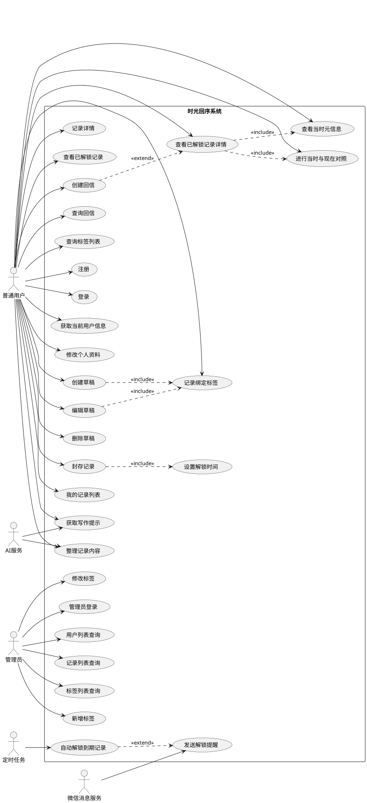
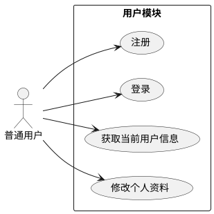
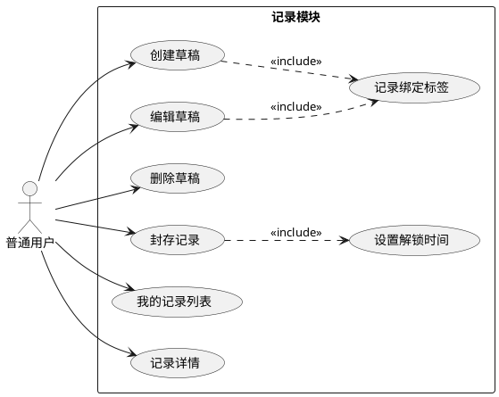
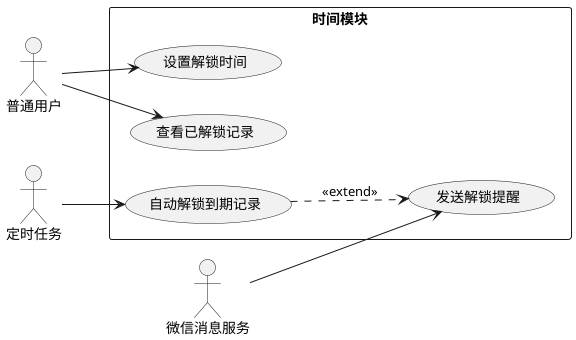
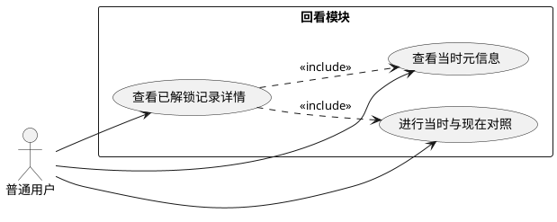
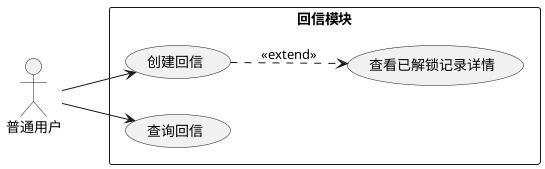
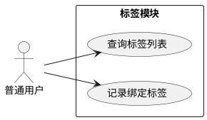
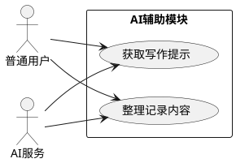
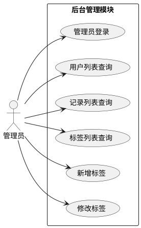

# 时光回序 UML 用例图源码包（可本地导出 PNG）

这份文档提供 **PlantUML 标准用例图源码**。
如果聊天里的下载链接失效，你可以直接把下面代码复制到本地 `.puml` 文件，再批量导出成 PNG。

## 推荐本地导出方式

### 方式一：VS Code 插件

1. 安装 **PlantUML** 插件
2. 安装 **Java**
3. 将下面代码分别保存为 `.puml`
4. 在 VS Code 中打开文件，右键 **Preview Current Diagram** 或 **Export Current Diagram**

### 方式二：命令行批量导出

1. 准备 `plantuml.jar`
2. 安装 Java
3. 在文件夹下执行：

```powershell
java -jar plantuml.jar *.puml -tpng
```

---

## 1. 项目总体用例图

保存为：`01_项目总体用例图.puml`



---

## 2. 用户模块用例图

保存为：`02_用户模块用例图.puml`



---

## 3. 记录模块用例图

保存为：`03_记录模块用例图.puml`



---

## 4. 时间模块用例图

保存为：`04_时间模块用例图.puml`



---

## 5. 回看模块用例图

保存为：`05_回看模块用例图.puml`



---

## 6. 回信模块用例图

保存为：`06_回信模块用例图.puml`



---

## 7. 标签模块用例图

保存为：`07_标签模块用例图.puml`



---

## 8. AI辅助模块用例图

保存为：`08_AI辅助模块用例图.puml`



---

## 9. 后台管理模块用例图

保存为：`09_后台管理模块用例图.puml`



---

## 10. 可选：批量渲染脚本

保存为：`render_all.ps1`

```powershell
$jar = ".\plantuml.jar"
Get-ChildItem -Filter *.puml | ForEach-Object {
    java -jar $jar $_.Name -tpng
}
Write-Host "全部 PNG 导出完成"
```

---

## 11. 建议的文件夹结构

```text
uml-usecase/
├─ plantuml.jar
├─ render_all.ps1
├─ 01_项目总体用例图.puml
├─ 02_用户模块用例图.puml
├─ 03_记录模块用例图.puml
├─ 04_时间模块用例图.puml
├─ 05_回看模块用例图.puml
├─ 06_回信模块用例图.puml
├─ 07_标签模块用例图.puml
├─ 08_AI辅助模块用例图.puml
└─ 09_后台管理模块用例图.puml
```
