# 《时光回序》模块用例与核心流程图（MVP）

## 1. 文档说明

本文档基于现有资料整理：
- 需求与设计：`需求分析.md`、`设计文档.md`
- 范围与规则：`MVP开发说明.md`、`MVP开发TODO.md`
- 接口边界：`接口清单文档.md`
- 数据与状态：`数据库设计文档.md`

统一角色定义：
- 普通用户：使用 `/api/**` 的业务用户
- 管理员：使用 `/admin/**` 的后台管理用户
- 定时任务：系统调度器，执行自动解锁
- AI服务：写作提示与内容整理能力
- 微信消息服务：解锁后订阅提醒（已授权用户）

---

## 2. 用户模块

### 2.1 用例图

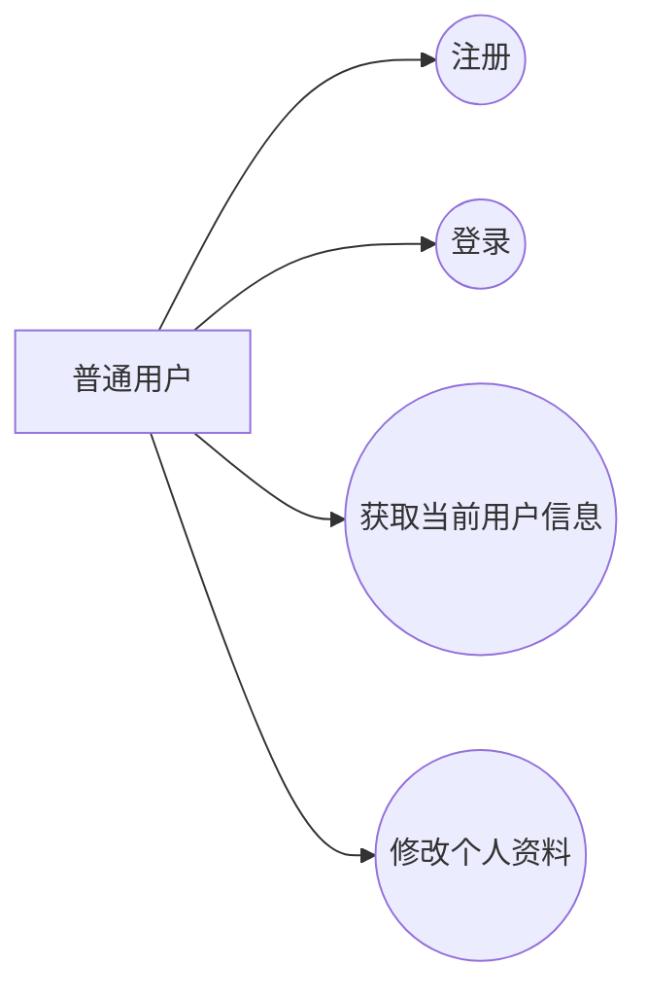

### 2.2 用例说明

| 用例 | 参与者 | 前置条件 | 后置条件 | 主成功场景 | 异常/约束 |
| ---- | ---- | ---- | ---- | ---- | ---- |
| 注册 | 普通用户 | 用户名未被占用 | 生成用户账号 | 提交用户名/密码/昵称，系统校验并创建用户 | 用户名重复返回业务错误 |
| 登录 | 普通用户 | 账号存在且状态为 ENABLED | 返回 JWT 与用户信息 | 提交账号密码，校验成功后签发 token | 状态 DISABLED 禁止登录 |
| 获取当前用户信息 | 普通用户 | 已登录且 token 有效 | 返回当前用户详情 | 通过 token 识别 userId，查询并返回资料 | token 无效返回未登录错误 |
| 修改个人资料 | 普通用户 | 已登录 | 用户资料更新成功 | 更新昵称/邮箱/头像 | 不能修改用户名和密码 |

### 2.3 核心业务流程图（顺序图：登录）

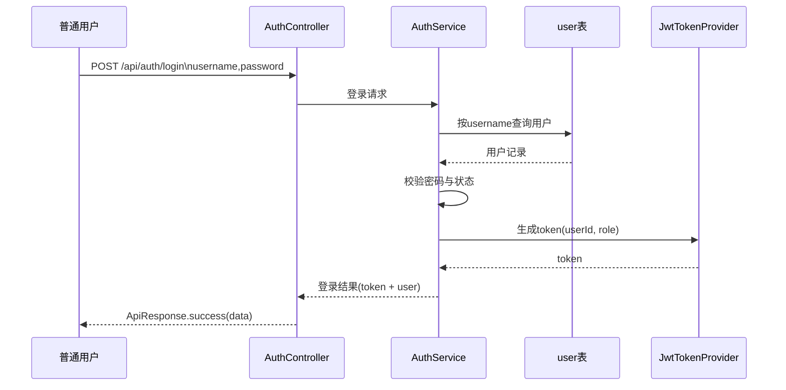

---

## 3. 记录模块

### 3.1 用例图

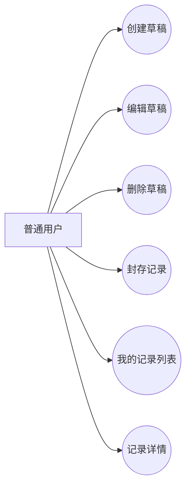

### 3.2 用例说明

| 用例 | 参与者 | 前置条件 | 后置条件 | 主成功场景 | 异常/约束 |
| ---- | ---- | ---- | ---- | ---- | ---- |
| 创建草稿 | 普通用户 | 已登录 | record.status=DRAFT | 提交内容、类型、标签等信息创建记录 | 记录归属必须为当前用户 |
| 编辑草稿 | 普通用户 | 已登录且记录归属本人 | 草稿内容更新 | 修改标题/正文/标签/解锁时间 | 仅 DRAFT 可编辑 |
| 删除草稿 | 普通用户 | 已登录且记录归属本人 | 草稿被删除 | 删除指定草稿记录 | 仅 DRAFT 可删除 |
| 封存记录 | 普通用户 | 已登录且记录归属本人 | 状态变更为 SEALED | 提交 unlockAt，系统封存并写 sealedAt | unlockAt 必须晚于当前时间 |
| 我的记录列表 | 普通用户 | 已登录 | 返回分页记录 | 按状态/类型/标签/关键字筛选 | 仅返回当前用户数据 |
| 记录详情 | 普通用户 | 已登录且记录归属本人 | 返回详情与可回信标记 | 查询单条记录及标签等信息 | SEALED 也允许本人查看 |

### 3.3 核心业务流程图（状态图：记录生命周期）

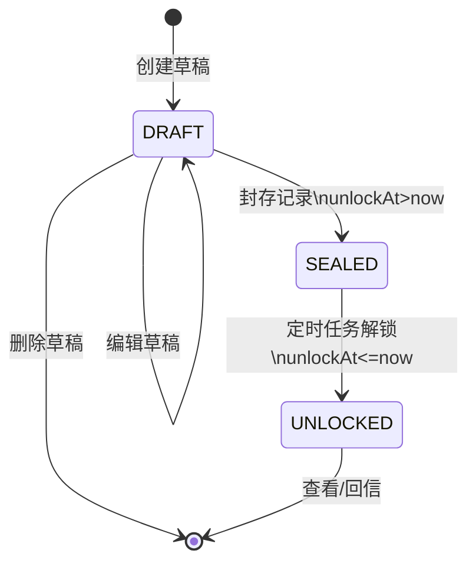

---

## 4. 时间模块

### 4.1 用例图

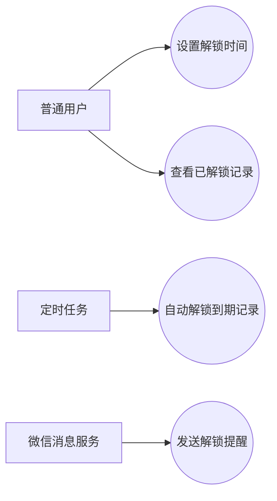

### 4.2 用例说明

| 用例 | 参与者 | 前置条件 | 后置条件 | 主成功场景 | 异常/约束 |
| ---- | ---- | ---- | ---- | ---- | ---- |
| 设置解锁时间 | 普通用户 | 记录为 DRAFT 且归属本人 | 记录具备 unlockAt | 在封存时提交解锁时间 | unlockAt 必须大于当前时间 |
| 自动解锁到期记录 | 定时任务 | 存在 SEALED 且到期记录 | 状态改为 UNLOCKED | 定时扫描并更新状态、写 unlockedAt | 必须幂等，避免重复解锁 |
| 发送解锁提醒 | 定时任务、微信消息服务 | 用户已授权订阅消息 | 产生提醒发送结果日志 | 解锁后调用微信服务发送提醒 | 发送失败不影响解锁主流程 |
| 查看已解锁记录 | 普通用户 | 已登录 | 返回已解锁分页列表 | 首页或快捷入口查询 UNLOCKED 数据 | 仅返回本人记录 |

### 4.3 核心业务流程图（顺序图：定时解锁）

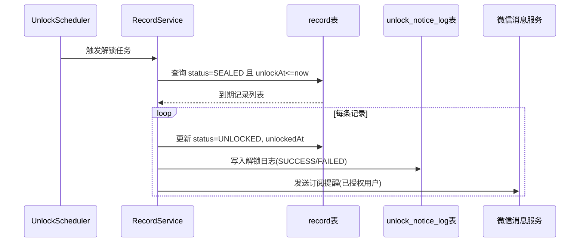

---

## 5. 回看模块

### 5.1 用例图

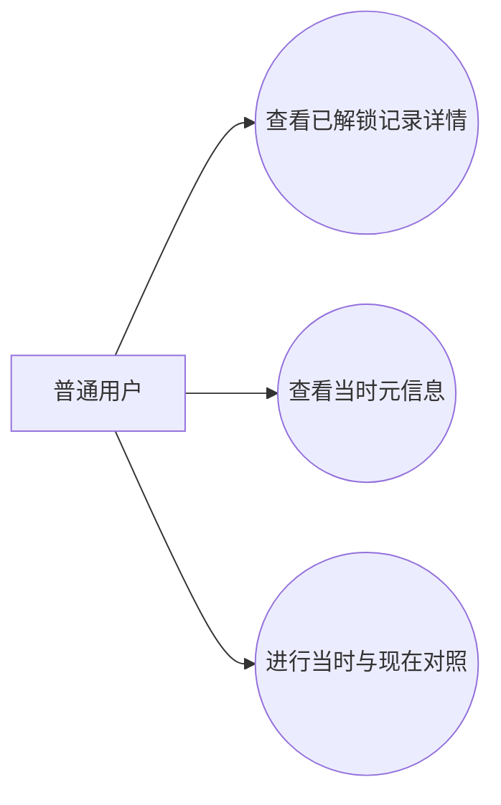

### 5.2 用例说明

| 用例 | 参与者 | 前置条件 | 后置条件 | 主成功场景 | 异常/约束 |
| ---- | ---- | ---- | ---- | ---- | ---- |
| 查看已解锁记录详情 | 普通用户 | 已登录且记录归属本人 | 返回完整记录内容 | 查看标题、正文、类型、标签、状态等 | 非本人记录禁止访问 |
| 查看当时元信息 | 普通用户 | 记录存在 | 展示写下时上下文 | 展示写下日期、标签、核心问题、已过去天数 | 仅展示本人的记录元信息 |
| 当时与现在对照 | 普通用户 | 记录已解锁 | 完成一次回望 | 用户基于引导问题进行回顾 | 回看不强制触发回信 |

### 5.3 核心业务流程图（活动图：解锁后回看）

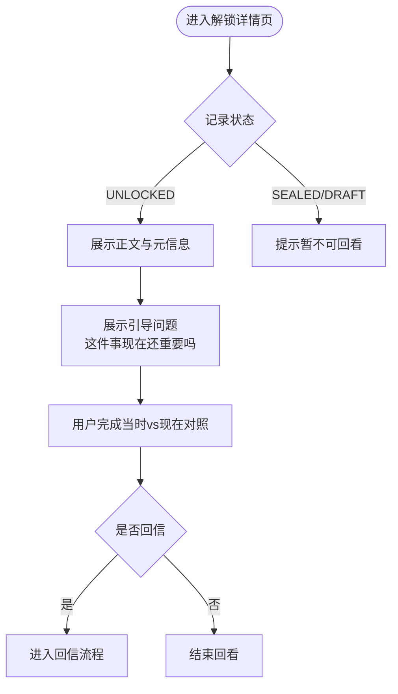

---

## 6. 回信模块

### 6.1 用例图

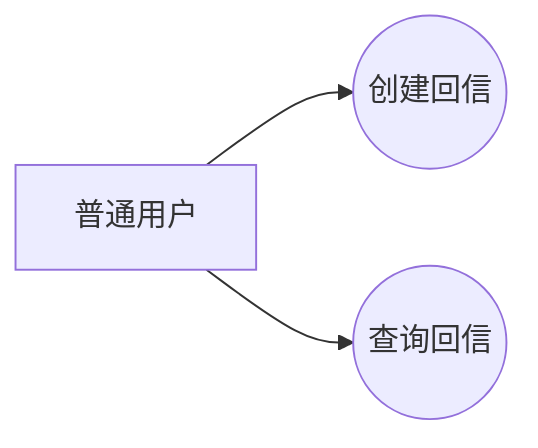

### 6.2 用例说明

| 用例 | 参与者 | 前置条件 | 后置条件 | 主成功场景 | 异常/约束 |
| ---- | ---- | ---- | ---- | ---- | ---- |
| 创建回信 | 普通用户 | 已登录，记录归属本人且状态 UNLOCKED | 生成一条 reply | 提交 content + replyType 保存回信 | 同一记录只允许一条回信 |
| 查询回信 | 普通用户 | 已登录且记录归属本人 | 返回回信详情或 null | 查询指定记录回信 | 非本人记录禁止查询 |

### 6.3 核心业务流程图（顺序图：创建回信）

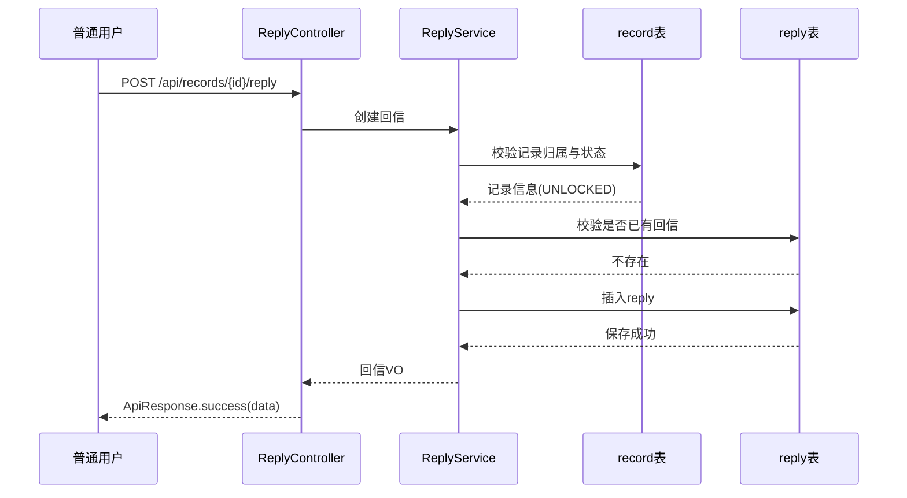

---

## 7. 标签模块

### 7.1 用例图

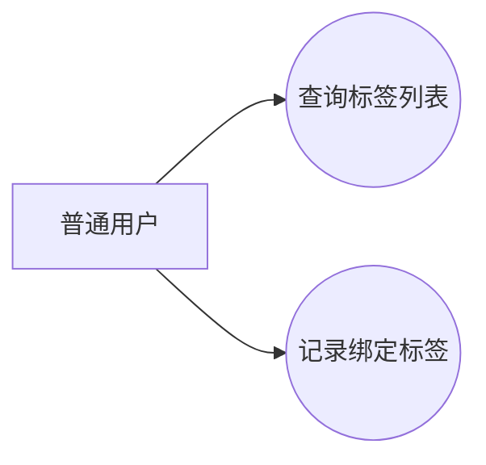

### 7.2 用例说明

| 用例 | 参与者 | 前置条件 | 后置条件 | 主成功场景 | 异常/约束 |
| ---- | ---- | ---- | ---- | ---- | ---- |
| 查询标签列表 | 普通用户 | 已登录 | 返回启用标签列表 | 按 type 查询 MOOD/TOPIC 标签 | 仅返回 status=ENABLED 标签 |
| 记录绑定标签 | 普通用户 | 已登录且记录归属本人 | record_tag 关联生效 | 在创建/编辑草稿时提交 tagIds | 不允许绑定不存在标签 |

### 7.3 核心业务流程图（顺序图：查询标签）

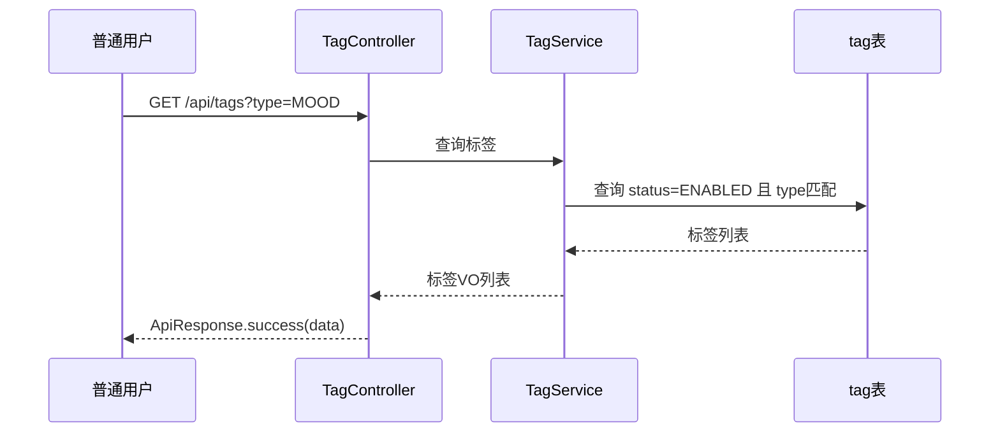

---

## 8. AI辅助模块

### 8.1 用例图

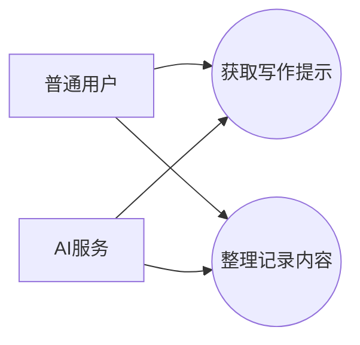

### 8.2 用例说明

| 用例 | 参与者 | 前置条件 | 后置条件 | 主成功场景 | 异常/约束 |
| ---- | ---- | ---- | ---- | ---- | ---- |
| 获取写作提示 | 普通用户、AI服务 | 已登录 | 返回 prompts 列表 | 提交 recordType/coreQuestion/content 获取提示词 | AI 失败返回兜底提示 |
| 整理记录内容 | 普通用户、AI服务 | 已登录 | 返回 summary + coreQuestion | 提交 content 获取整理结果 | AI 超时或异常返回安全空结果 |

### 8.3 核心业务流程图（顺序图：AI写作提示） 

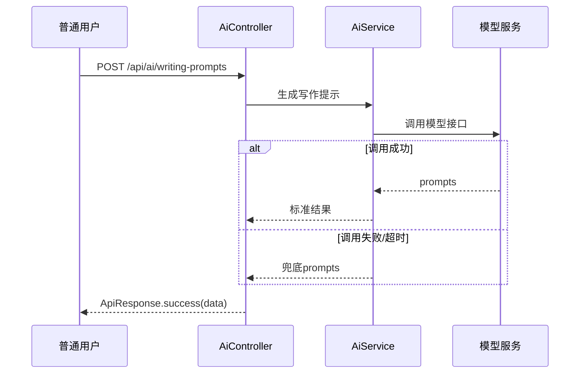

---

## 9. 后台管理模块

### 9.1 用例图

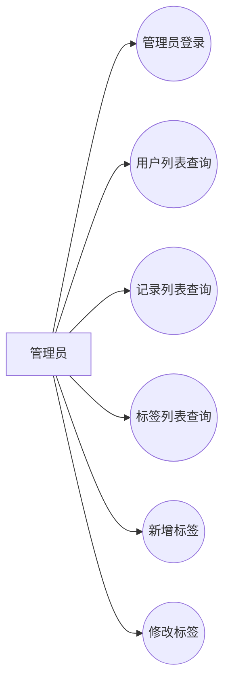

### 9.2 用例说明

| 用例 | 参与者 | 前置条件 | 后置条件 | 主成功场景 | 异常/约束 |
| ---- | ---- | ---- | ---- | ---- | ---- |
| 管理员登录 | 管理员 | 管理员账号可用 | 返回 admin token | 提交管理员账号密码登录 | DISABLED 状态禁止登录 |
| 用户列表查询 | 管理员 | 已登录后台 | 返回分页用户数据 | 按关键字/状态筛选 | 仅管理员可访问 |
| 记录列表查询 | 管理员 | 已登录后台 | 返回分页记录数据 | 按状态/类型/userId 筛选 | 管理端只读，不修改正文 |
| 标签管理 | 管理员 | 已登录后台 | 标签增改成功 | 新增/修改标签信息 | 标签名与类型需满足唯一约束 |

### 9.3 核心业务流程图（顺序图：管理员查询记录）

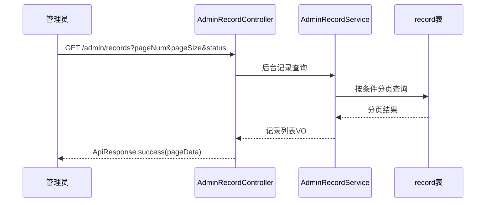

---

## 10. 说明与落地建议

- 图中状态流转严格采用：`DRAFT -> SEALED -> UNLOCKED`
- 回信规则固定：仅 `UNLOCKED` 且每条记录仅一条回信
- AI规则固定：失败可降级，不能成为主流程阻塞点
- 管理端权限与用户端权限严格隔离

以上可直接作为后续详细设计、接口测试用例、以及答辩展示的基础图稿。

---

## 11. 过程模型图（开发阶段）

本节用于梳理《时光回序》MVP从需求到验收的完整开发流程，便于项目排期、任务拆解、联调推进与阶段复盘。

### 11.1 开发总流程（活动图）

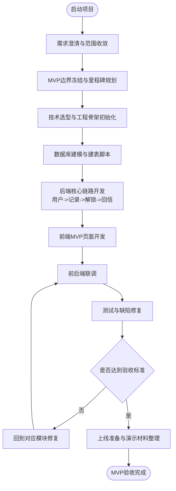

### 11.2 跨成员协作流程（泳道图，可忽略）

成员分工：
- A：用户模块
- B：记录模块
- C：回信模块
- D：回看模块
- E：时间模块、AI模块、后台管理模块

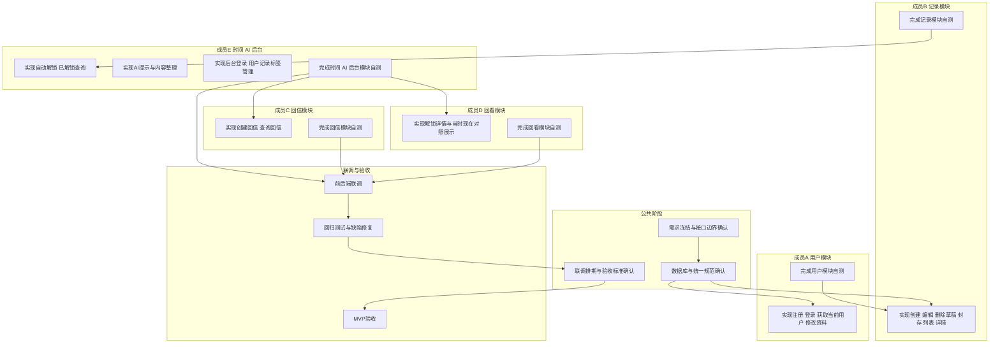

### 11.3 迭代工作流（状态图）

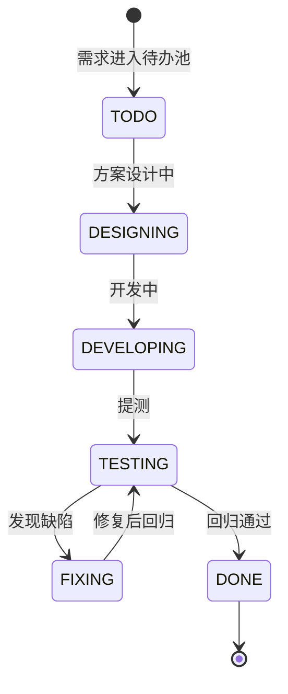

### 11.4 阶段产出与里程碑

| 阶段 | 核心目标 | 关键产出 | 验收要点 |
| ---- | ---- | ---- | ---- |
| 需求与方案阶段 | 明确做什么、不做什么 | 需求文档、设计文档、接口清单 | MVP边界是否清晰 |
| 工程初始化阶段 | 能启动、能连接、能鉴权 | 后端骨架、统一返回体、全局异常、JWT基础能力 | 基础接口可用 |
| 核心业务开发阶段 | 打通主链路 | 用户/记录/解锁/回信模块 | 状态流转正确且可复现 |
| 前端联调阶段 | 形成可演示产品 | 页面主流程、接口联调通过 | 端到端流程可走通 |
| 测试与收尾阶段 | 保证稳定与可交付 | 测试记录、缺陷清单、演示脚本 | 满足MVP验收5条标准 |

### 11.5 流程落地建议

- 以“主链路优先”推进开发：先保证 记录->封存->解锁->回看->回信 可完整演示。
- 每完成一个模块后立即做接口自测和联调，不把问题堆到最后统一处理。
- 用固定状态枚举和错误码约束实现，避免迭代中出现隐性返工。
- 测试阶段重点覆盖越权访问、状态越迁、重复提交与定时任务幂等场景。
